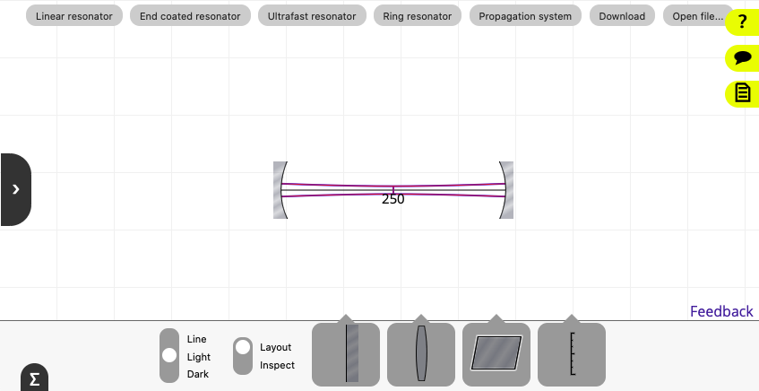
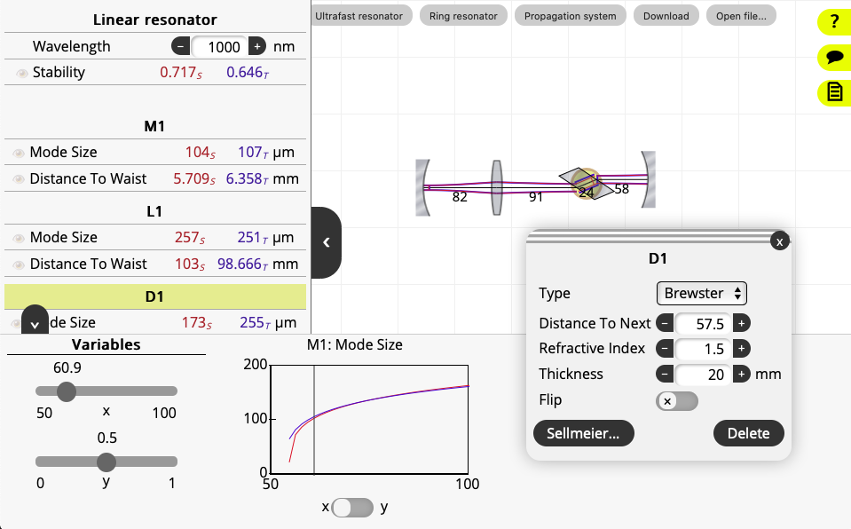

# LaserCanvas - Web

Interactive laser cavity modeling.

Live Demo: https://pschlupnzl.github.io/lasercanvas/

The web app is designed to start simple:

* Choose a system type (resonator, propagation etc.).
* Drag the optics around directly on the canvas. Grab the elements at the
    centerline.
* Add more elements by dragging them from the toolbar.
* Tap each element to edit its properties in a popup.

For basic analysis:

* Choose the <em>Inspect</em> tool in the toolbar.
* Tap to open the sidebar, which lists calculated beam values at each element.

Advanced modeling:

* Specify element properties as functions of variables <em>x</em> and/or
<em>y</em>.
* Tap to pull up the variables bar to specify the range each variable can take.
    Drag the sliders to change the variable values.
* Use the sidebar to mark properties to be graphed.
* Download the resulting cavity as an SVG image or as a data file that can be
    opened again later.

## Underlying principles

In the <em>ABCD</em> formalism (see e.g. <em>Lasers</em> by Siegman), the
properties of a Gaussian beam are represented by two values, corresponding
roughly to the spot size and wavefront curvature or divergence angle.

The effect of simple optical elements such as lenses and mirrors on the beam
are modelled as 2&times;2 matrices, called <em>ABCD</em> denoting each element
in the matrix.

A stable intracavity beam can be deduced for an optical cavity if the starting
beam parameters are reproduced on each roundtrip.

## System types

There are several different types of optical systems preconfigured. To switch
between them, tap the corresponding button. Any existing system will be
discarded.

### Linear resonator

This is a canonical two mirror, standing wave cavity. The cavity roundtrip
matrix is calculated by multiplying the elements in a forward, then a backward
direction. The ends of the cavity are always mirrors and cannot be deleted.

### End coated resonator

This is similar to the Linear resonator, with the difference that the first
element is a reflective surface on a dielectric medium.

### Ultrafast resonator

This is a standing wave resonator that includes dispersion compensation
elements. At present, only a prism compressor is supported. Choosing this
system type also enables dispersion calculations in the sidebar.

### Ring resonator

This corresponds to a travelling wave cavity. The roundtrip matrix is calculated
by multiplying the elements in a forward direction only. The cavity is closed
by a straight empty segment between two mirrors that cannot be deleted.

### Propagation system

This system calculates the forward propagating beam only, without solving for a
roundtrip stability matrix. The beam starting parameters can be set in the
sidebar.
